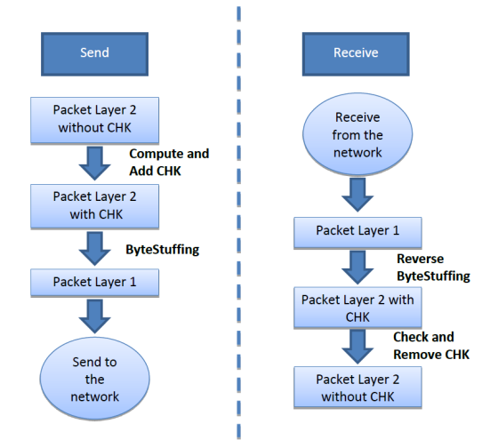

# Serial Protocol

## Introduction
The aim of this document is to describe the serial communication protocol used in ST by the AST-Robotics team. This document describes the bit-level message format and some of the higher level commands.

## 1. Data format
The serial protocol defines two layers: a first lower layer, hereafter named “Layer 1”, and a second upper layer, “Layer 2”.

The Layer 1 packet is defined as follows:

| Encoded Payload | End of File (EOF) |
| :-------------: | :---------------: |
|     N bytes     |   1 byte: 0xF0    |

Where: 
- **Encoded Payload**: is the message exchanged by the protocol between the module and a host. Its length can change but it is limited by the physical MTU (Maximum Transmission Unit). The actual payload is encoded by the **ByteStuffing** function, described later in this document, in order to avoid any EOF character in its content. 
- **EOF (0xF0)**: byte representing the end of the packet. It has the value: 0xF0.

The Encoded Payload of Layer 1 must be decoded by the **reverseByteStuffing** function described later, in order to obtain the Payload. The resulting Payload is a Layer 2 packet which has the following format:

| Destination Address | Source Address | Command (CMD) | Payload | Checksum (CHK) |
| :-----------------: | :------------: | :-----------: | :-----: | :------------: |
|       1 byte        |     1 byte     |    1 byte     | N bytes |     1 byte     |

Where: 
- **Destination Address**: destination address. Packets are sent to the selected recipient on the shared bus (unicast). 
- **Source Address**: source address. 
- **Command (CMD)**: command code. It specifies how the payload is interpreted. 
- **Payload**: command parameters. Bytes are interpreted based on the command code.
- **Checksum (CHK)**: value that makes the sum of all the bytes in the packet to be zero (see section 2.1).

## 2. Processes involved in sending/receiving packets
The following figure shows the sequence of steps to send and receive a packet. Checksum and byte stuffing functions, and their inverse, ensure the correct transmission of the messages.



### 2.1 Checksum Algorithm
The checksum algorithm ensures that the packet you handle contains the correct information. 

The **ComputeAndAddCHK**  function computes the checksum value that makes the sum of all bytes in the packet, including the checksum itself, equal to zero. This is the corresponding pseudo-code:


**ComputeAndAddCHK**

```c
{
  uint_8 CHK = 0
  for (i = 0; i < layer2length, i++) 
  {
    CHK = CHK - layer2data[i]
  }
  layer2data[layer2length + 1] = CHK
}
```
The **CheckAndRemoveCHK**  function verifies that indeed the sum of all bytes in the packet is zero. This is the corresponding pseudo-code:

**CheckAndRemoveCHK**

```c
{
  uint_8 CHK = 0
  for (i = 0; i < layer2length; i++)
  {
    CHK = CHK + layer2data[i]
  }
  layer2length = layer2length - 1
  return (CHK == 0)
}
```

### 2.2 Byte Stuffing
Byte stuffing is a process that transforms a sequence of data bytes that may contain 'illegal' or 'reserved' codes into a potentially longer sequence that contains no occurrences of those codes. In this case the EOF code identifies the end of the packet, therefore the packet must not contain any other occurrence of EOF code.

Byte stuffing: each reserved code (**TMsg_EOF 0xF0**) in the payload is substituted by an 'escape' code (**TMsg_BS 0xF1**) followed by a suitable code (**TMsg_BS_EOF 0xF2**). Of course, the EOF that comes after the payload is left untouched. The escape code itself is a reserved code and must be encoded in the same way. As a result the following substitutions are performed in the payload:

- the reserved EOF 0xF0 becomes 0xF1 0xF2
- the escape code 0xF1 becomes 0xF1 0xF1

Reverse byte stuffing: when the escape code is found in the payload, the next byte is used to determine the substitution:
- the sequence 0xF1 0xF2 becomes EOF 0xF0
- the sequence 0xF1 0xF1 becomes 0xF1

## 3 Standard Commands

A set of fundamental and standard commands are defined in this document. The protocol can be extended in order to accommodate more commands which are specifically related to the target application.

The standard commands are summarized in the following table:

| Command | CMD code | Meaning |
| ------- | --------- | ------- |
| CMD_PING | 0x01 | This is the standard ping command, the device will reply accordingly. |
| CMD_Read_PresString | 0x02 | Requests the presentation string which contains basic device information (name and version) |
| CMD_Reset | 0x0F | Requests a reboot of the device |
<br>

Whenever a command is received, an acknowledge is generated. the CMD code in the acknowledge message is computed by adding **CMD_Reply_Add 0x80** to the received CMD code.

The command code CMD is followed by N bytes of Payload with command parameters. Data The length of the payload is variable and depends on how command parameters are embedded in the payload. Data is serialized, that is converted to a sequence of bytes, to be independent of the endianness of  architecture. Data fields are separated by suitable terminators and escape codes.

The commands, in Layer 2 format, are explained here in more detail.

### 3.1 CMD_PING
The packet to ping the destination device is formatted as follows:

| Destination Address | Source Address | Command (CMD) |
| :--: | :-----------------: | :------------: |
| 1 byte: 0xXX | 1 byte: 0xYY | 1 byte: 0x01 (CMD_PING) |
<br>  

The module will answer with the same packet format but source and destination addresses will be swapped and the command field will contain CMD_PING + CMD_Reply_Add:

| Destination Address | Source Address |              Command (CMD)              |
| :-----------------: | :------------: | :-------------------------------------: |
|    1 byte: 0xYY     |  1 byte: 0xXX  | 1 byte: 0x81 (CMD_PING + CMD_Reply_Add) |
<br>

### 3.1 CMD_Read_PresString
The packet to request the presentation string is formatted as follows:

| Destination Address | Source Address |           Command (CMD)            |
| :-----------------: | :------------: | :--------------------------------: |
|    1 byte: 0xXX     |  1 byte: 0xYY  | 1 byte: 0x02 (CMD_Read_PresString) |
<br>

The reply message will be formatted as follows:

| Destination Address | Destination Address | Command (CMD) | Payload |
| :--: | :-----------------: | :------------: | :-----: |
| 1byte: 0xYY | 1 byte: 0xXX | 1 byte: 0x82 (CMD_Read_PresString+ CMD_Reply_Add) | N bytes: string |

### 3.3 CMD_Reset
The packet to request a device reset  is formatted as follows: 

| Destination Address | Source Address |      Command (CMD)       |
| :-----------------: | :------------: | :----------------------: |
|    1 byte: 0xXX     |  1 byte: 0xYY  | 1 byte: 0x0F (CMD_Reset) |
<br>

The module will reboot and no reply will be sent to acknowledge. The host can check the new state of the module using other application dependent commands.

## 4 CMD_PING Example
In this example, we consider the ping command, how to form the request and its response at “Layer 1” and “Layer 2” (see the general Serial Protocol document for more information about layers).

### 4.1 Ping Request
Assuming the sender address is 0xF0, equal to the reserved EOF code; destination code is 0x42.

The checksum is added. The Layer 2 (before byte stuffing) request packet is:

| Destination Address | Source Address | Command (CMD) | Checksum (CHK) |
| :--: | :-----------------: | :------------: | :-----: |
| 0x42 | 0xF0 | 0x01 (CMD_PING) | 205 = 0xCD |
<br>

Payload is encoded and EOF is added. The Layer 1 (after byte stuffing) request packet is:

| Byte1 | Byte2 | Byte3 | Byte4 | Byte5 | Byte6 |
| :-: | :-: | :-: | :-: | :-: | :-: |
| 0x42 | TMsg_BS = 0xF1 | TMsg_BS_EOF = 0xF2 | 0x01 | 0xCD | TMsg_EOF =0xF0 |
<br>

### 4.1 Ping Reply
The packet is received at “Layer 1”. After the reverse byte stuffing and checksum verification, the original packet is parsed (at “Layer 2”).  Upon a request of PING the “Layer 2 ” (before byte stuffing) reply will be the following:
| Destination Address | Source Address | Command (CMD) | Checksum (CHK) |
| :--: | :-----------------: | :------------: | :-----: |
| 0xF0 | 0x42 | 0x81 (CMD_PING + CMD_Reply_Add) | 77 = 0x4D |
<br>

The Layer 2 (before byte stuffing) request packet is:
| Byte1 | Byte2 | Byte3 | Byte4 | Byte5 | Byte6 |
| :-: | :-: | :-: | :-: | :-: | :-: |
| TMsg_BS = 0xF1 | TMsg_BS_EOF = 0xF2 | 0x42 | 0x81 | 0x4D | TMsg_EOF =0xF0 |
<br>
