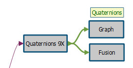

# Communication protocol for firmware generated by AlgoBuilder

## 1. Communication protocol

AST serial protocol is used for communication. The protocol is described in [AST Serial Protocol](ASTSerialProtocol.md) file. All necessary functions are defined in *serial_protocol.c* and *serial_protocol.h* files which can be found inside the firmware template directory.

## 2. Communication over virtual COM port (VCOM)

The virtual COM port is available after the device is connected with the USB cable.

**Serial port parameters:**  
Baud Rate: 921600  
Parity: None  
Data bits: 8  
Stop Bit : 1  
Flow Control: No 

Each message is processed by *serial_protocol.h* functions and then sent through the serial line.  The header with the payload is prepared. The checksum code is computed and added at the end of message. Byte stuffing is performed to avoid end-of-file (EOF) code emulation. Finally the EOF code (0xF0) is added at the end of the message.

Typical formats for messages:  

| Dest. Address | Src. Address | Command |
| :-----------: | :----------: | :-----: |
|    1 byte     |    1 byte    | 1 byte  |

| Dest. Address | Src. Address | Command | Payload |
| :-----------: | :----------: | :-----: | :-----: |
|    1 byte     |    1 byte    | 1 byte  | 1 byte  |

| Dest. Address | Src. Address | Command | SubCommand |   ID   |
| :-----------: | :----------: | :-----: | :--------: | :----: |
|    1 byte     |    1 byte    | 1 byte  |   1 byte   | 1 byte |

| Dest. Address | Src. Address | Command | SubCommand |   ID   | Payload |
| :-----------: | :----------: | :-----: | :--------: | :----: | :-----: |
|    1 byte     |    1 byte    | 1 byte  |   1 byte   | 1 byte | N bytes |
<br>

The command field in reply messages will be set to Command code + CMD_Reply_Add (0x80).

Here is the list of available Command codes, together with SubCommand (SC) codes used by the communication protocol:

```c
#define CMD_Ping                    0x01
#define CMD_Read_PresString         0x02
#define CMD_Get_Streaming_Status    0x03
#define CMD_Report_Error            0x04
#define CMD_Start_Data_Streaming    0x08
#define CMD_Stop_Data_Streaming     0x09
#define CMD_Set_DateTime            0x0C
#define CMD_Enter_DFU_Mode          0x0E // Direct Firmware Upgrade
#define CMD_Reset                   0x0F
#define CMD_Offline_Data            0x10  
#define CMD_GetFW_Info              0x11
#define CMD_Sensor                  0x50
#define CMD_Reply_Add               0x80

#define SC_GET_CUSTOM_CONFIG        0x09
#define SC_GET_CONFIG_STRING        0x19  
#define SC_SET_CUSTOM_VALUES        0x0C
#define SC_GET_CUSTOM_VALUES        0x1A
```
### 2.1 Read the Presentation String
This is the first command when initiating the communication. By reading the presentation string with the command  “CMD_Read_PresString“  the program can verify that the supported firmware is programmed into device. The presentation string is defined in *demo_serial.c*.

Assuming the destination address is 50, and the source address is 1, send:
| Dest. Address | Src. Address |          Command           |
| :-----------: | :----------: | :------------------------: |
|   50 = 0x32   |   1 = 0x01   | 0x02 (CMD_Read_PresString) |
<br>

Receive:
| Dest. Address | Src. Address | Command + CMD_Reply_Add |     Payload      |
| :-----------: | :----------: | :---------------------: | :--------------: |
|   1 = 0x01    |  50 = 0x32   |   0x02 + 0x80 = 0x82    | String (N bytes) |
<br>

Payload example:  "MEMS shield demo,201,6.1.0,0.0.0,IKS01A3". 

The comma "," separates the sub-strings. Sub-strings are interpreted as follows:

-	"MEMS shield demo": Identification string (always the same)
-	"201": Firmware ID (201 = AlgoBuilder generated FW)
-	"6.1.0": Firmware version
-	"0.0.0": Library version (not used)
-	"IKS01A3": Extension board name or device name (such as "SensorTile.box" or "STWIN")

### 2.2 Set Date and Time
The real-time clock on the device can be set with the command “CMD_Set_DateTime”. Setting the real-time clock is not mandatory but it useful for firmware with version lower than 9.0.0 because the timestamp sent in the data stream is derived directly from the real-time clock, see below "Data Streaming (receiving On-line data from the FW)". If it is not set, the real-time clock defaults to 1st January 2001, 00:00:00.

Send:
| Dest. Address | Src. Address |         Command         |                           Payload                            |
| :-----------: | :----------: | :---------------------: | :----------------------------------------------------------: |
|   50 = 0x32   |   1 = 0x01   | 0x0C (CMD_Set_DateTime) | 7 bytes: hours (1 byte), minutes (1 byte), seconds (1 byte), year-2000 (1 byte), month (1 byte), day (1 byte), week day (1 byte) |
<br>

Receive:
| Dest. Address | Src. Address | Command + CMD_Reply_Add |
| :-----------: | :----------: | :---------------------: |
|   1 = 0x01    |  50 = 0x32   |   0x0C + 0x80 = 0x8C    |
<br>

### 2.3 Read streaming status
The status of data streaming/recording can be verified with the command "CMD_Get_Streaming_Status". This command is useful because streaming and recording do not automatically stop when the device is disconnected, so the status must to be verified when the device is re-connected.  If streaming is active the response can be slower.

Send:
| Dest. Address | Src. Address |             Command             |
| :-----------: | :----------: | :-----------------------------: |
|   50 = 0x32   |   1 = 0x01   | 0x03 (CMD_Get_Streaming_Status) |
<br>

Receive:
| Dest. Address | Src. Address | Command + CMD_Reply_Add | Payload |
| :---: | :-----------: | :----------: | :--------------------:  |
| 1 = 0x01 |       50 = 0x32       |      0x03 + 0x80 = 0x83      |          status (1 byte)          |
<br>

Payload:
- **Status**: 0 - Streaming not active, 1 - streaming active

### 2.4 Get error list
The command "CMD_Report_Error" retrieves the information on any error that may have occurred during FW initialization. The corresponding response can be received asynchronously, if any error happens after initialization, when the FW device is running. Currently defined errors can only happen during initialization (see below).

Send:
| Dest. Address | Src. Address |         Command         |
| :-----------: | :----------: | :---------------------: |
|   50 = 0x32   |   1 = 0x01   | 0x04 (CMD_Report_Error) |
<br>

Receive:
| Dest. Address | Src. Address | Command + CMD_Reply_Add |                      Payload                       |
| :-----------: | :----------: | :---------------------: | :------------------------------------------------: |
|   1 = 0x01    |  50 = 0x32   |   0x04 + 0x80 = 0x84    | Nr of errors (4 bytes), Error codes (Nr * 4 bytes) |
<br>

Payload:
- **Nr of errors**: number of errors codes (unsigned int stored in 4 bytes). The MSB bit is set if not all error codes have been transmitted (this can happen when the size of the buffer to hold error codes has been exceeded).
- **Error codes**: array of error codes (array of unsigned ints, each entry occupies 4 bytes). This field is not present if the numbers of error is 0. The total length of this fields is 4 bytes multiplied by the number of errors.

Two errors are currently defined:
- AB_ERROR_ODR_CHANGED 1: sensor Output Data Rate changed unexpectedly
- AB_ERROR_FS_CHANGED 2 : sensor Full Scale has changed unexpectedly

Unexpected changes in Output Data Rate and Full Scale may happen during the initialization phase, when loading the *.ucf* file (Unico Configuration File) to configure the FSM/MLC embedded in the sensor (Finite State Machine / Machine Learning Core). The *.ucf* file must specify the same ODR and FS as configured in the "Sensor Hub" block in the AlgoBuilder design. If there is a mismatch, errors are reported. If there is a mismatch algorithms would not work as expected because the data will be sampled at a different rate and/or will have a different scaling.

### 2.5 Get FW configuration information
The command "CMD_GetFW_Info" is used to retrieve the FW configuration information. When "On-line" processing is selected, the data is read out from sensors on the device. When "Off-line" processing is selected, the device will receive the data as payload in data packets. 

Send:
| Dest. Address | Src. Address |        Command        |
| :-----------: | :----------: | :-------------------: |
|   50 = 0x32   |   1 = 0x01   | 0x11 (CMD_GetFW_Info) |
<br>

Receive:
| Dest. Address | Src. Address | Command + CMD_Reply_Add |              Payload               |
| :---: | :-----------: | :----------: | :--------------------:  |
| 1 = 0x01 |       50 = 0x32       |      0x11 + 0x80 = 0x91      | ODR (4 bytes), ID string (N bytes)  |
<br>

Payload:
- **ODR**: Requested Output Data Rate (ODR) for offline data processing (unsigned int stored in 4 bytes)
- **ID string**: string containing the "ID_STRING:" prefix followed by the name of the AlgoBuilder XML design file, a comma, and a string to specify if online or offline processing is selected ("On-line" or "Off-line")

Example of ID string: "ID_STRING:data_type1.xml,On-line")

### 2.6 Get Input/Output configuration

The command "CMD_Sensor" with “SC_GET_CUSTOM_CONFIG” subcommand is used to get information about inputs and outputs of the FirmWare. Inputs are values that the user can enter on the Graphical User Interface and are transmitted to the FW. Outputs are values generated and transmitted by the FW on the device, and received and displayed by the Graphical User Interface.

Send:
| Dest. Address | Src. Address | Command | SubCommand |  ID  |
| :-----------: | :----------: | :-----: | :--------: | :--: |
|   50 = 0x32   |   1 = 0x01   |  0x50   |    0x09    |  0   |
<br>

Receive:
| Dest. Address | Src. Address | Command + CMD_Reply_Add | SubCommand |  ID  |        Payload        |
| :---: | :-----------: | :----------: | :---------------------: | :--------: | :-: |
| 1 = 0x01 |       50 = 0x32       |     0x50 + 0x80 = 0xD0     |          0x09          |    0    | CUSTOM_CONFIG_PAYLOAD |
<br>

Payload is formatted as follows: the first byte is the number of records, each record is made of 4 bytes plus 0 or more additional bytes. The code that describes the payload is the following:
```c
typedef struct {
   unsigned char config_record_count; /* Size of following array */
   CONFIG_RECORD records[];           /* Variable size array */
} CUSTOM_CONFIG_PAYLOAD;
    
typedef struct {`  
  unsigned char var_count;   /* For example number of axis in graph */
  unsigned char var_type;    /* See below */
  unsigned char conn_count;  /* Size of following array */
  unsigned char conn[];      /* Variable size array of connection indexes */
} CONFIG_RECORD;`  

const unsigned char VAR_TYPE_FLOAT = 1;
const unsigned char VAR_TYPE_INT32 = 2;
const unsigned char VAR_TYPE_BIT = 3; 
```

*var_count* and *var_type* (float32, int32, or bit) support the computation of the offset to correctly parse the payload of data packets (see "Data Streaming" below). Floats and 32bit integers occupy 4 bytes. Individual bits are grouped into bytes, up to 16 bits can be transmitted (2 bytes). 

If the MSB bit of the *var_type* field is set then it is input data (sent by the GUI to the FW), otherwise it is output data (sent by the FW to the GUI).

*conn_count* specifies the number of entries in the *conn[]* array and cannot be 0. Each entry in the *conn[]* array specifies in which view the output data must be displayed or from which dialog the input data must be taken (values starts from 1). Output data can be mapped into multiple views (this is done to save space in the stream and avoid resending the same data multiple times)

```c
if (cr->var_type & 0x80) is_input = true;
config_record.var_type = cr->var_type & 0x7F;
if (!is_input)
{
  config_record.position = stream_position;
  if (config_record.var_type == VAR_TYPE_BIT)
  {
    if (config_record.var_count > 8)
    {
      /* var_count for VAR_TYPE_BIT is limited to 16 */
      stream_position += 2;
    }
    else
    {
      stream_position += 1;
    }
  }
  else
  {
    stream_position += config_record.var_count * 4;
  }
}
```

Example of reply message (24 bytes in total): 0x01 32 D0 09 00 04 03 01 01 01 01 03 01 02 04 01 02 03 04 06 01 01 05 C8 

- 0x01 is the destination address (the Graphical User Interface)
- 0x32 is the source address (the device with sensors that will be streaming the data)
- 0xD0 is the acknowledge command code (CMD_Sensor + CMD_Reply_Add)
- 0x09 is the the command subcommand code
- 0x00 is the ID

Then there is the CUSTOM_CONFIG_PAYLOAD:

- 0x04 is the number of inputs/outputs
- First output: 3 x Float32 output, at offset 0, total length 3 x 4 = 12 bytes
  - 0x03 var_count for 1st output (3 axis)
  - 0x01 var_type for 1st output (Float32)
  - 0x01 conn_count for 1st output
  - 0x01 conn[0] for 1st output, mapped to view #1
- Second output: 1 bit stored in 1 byte, at offset 0 + 12 = 12, total length 1 byte
  - 0x01 var_count for 2nd output (1 bit)
  - 0x03 var_type for 2nd output (bit)
  - 0x01 conn_count for 2nd output
  - 0x02 conn[0] for 2nd output, mapped to view #2
- Third output: 4 x Float32 output, at offset 12 + 1 = 13, total length 4 x 4 = 16 bytes 
  - 0x04 var_count for 3rd output (4 axis)
  - 0x01 var_type for 3rd output (Float32)
  - 0x02 conn_count for 3rd output
  - 0x03 conn[0], mapped to view #3
  - 0x04 conn[1], mapped to view #4
- Fourth output: 6 x Float32, at offset 13 + 16 = 29, total length 6 x 4 = 24 bytes
  - 0x06 var_count for 4th output (6 axis)
  - 0x01 var_type for 4th output (Float32)
  - 0x01 conn_count for 4th output
  - 0x05 conn[0] for 4th output, mapped to view #5

Then there is the checksum: 0xC8

This is a summary of the data that must be stored to support the correct parsing of the payload of data packets (see "Data Streaming" below).

| in/out | var_cnt | var_type | conn_count | conn[] index | offset (length) |
| --- | - | ----- | - | --- | ------- |
| out | 3 | float | 1 | 1   | 0 (12)  |
| out |	1 |	bit   |	1 |	2	| 12 (1)  |
| out |	4 |	float |	2 |	3, 4	| 13 (16) |
| out |	6 |	float |	1 |	5	| 29 (24) |
<br>

The 3rd output in this example is a vector of 4 Float32 which corresponds to a quaternion. The quaternion is displayed in view #3 ("Graph") and also sent to view #4 ("Fusion" which displays a an animated 3D model with the orientation specified by the quaternion, the 3D model is the well-know "teapot" or the model of the device with sensors).



### 2.7 Get Display configuration
The command "CMD_Sensor" with “SC_GET_CONFIG_STRING” subcommand is used to retrieve the display configuration for view (connection index) of the output data.   

Send:
| Dest. Address | Src. Address | Command | SubCommand | ID |
| :---: | :-----------: | :----------: | :-----: | :--------: |
| 50 = 0x32 |      1 = 0x01      |      0x50      |  0x19  |    connection index (1 byte)    |
<br>

Receive:
| Dest. Address | Src. Address | Command + CMD_Reply_Add | SubCommand |          ID          | Payload |
| :---: | :-----------: | :----------: | :---------------------: | :--------: | :-: |
| 1 = 0x01 |       50 = 0x32       |     0x50 + 0x80 = 0xD0     |          0x19          |    conn. index (1 byte)    |N bytes string  |
<br>

The configuration string contains the data to configure the display window. Items inside this string are separated by the vertical bars "|". The first item specify the type of the view (graph, scatter plot, 3D plot, and others, see list below) . These strings can be found inside *algo_builder.c* file in the static initialization of the *display_info_list* variable.  

Configuration strings for each type of view:

**Graph**  
“graph|window title|units|full scale|zero axis position + data type|waveform 1 name|…| waveform 6 name|autoscale”  

- zero axis position: 1 – bottom, 3 – middle, 5 – top
- data type: 16 – float value, 0 – int32 value

Example:
- "graph|Acceleration|mg|4000|3|accX|accY|accZ||||0"  
- "graph|Acceleration|g|2|19|X axis|Y axis|Z axis||||1"

**FFT**  
“fft|window title(\n for new line)|data length|full scale|autoscale|units”

- data length - number of FFT coefficients (samples) selected in "FFT PLot" display block properties - (inside FFT stream just half of coefficients are sent, second half is symetric)

Example:  
- "fft|FFT\nX axis|512|1|1|g"  

 **Values**  
“float or int32|window title|value1 name|value1 units|…|value8 name|value8 units”  

Example:  
- "float|FFT Peaks|X - Amp|[mg]|X - Freq|[Hz]|Y - Amp|[mg]|Y - Freq|[Hz]|Z - Amp|[mg]|Z - Freq|[Hz]||||"  
- "int32|Values|Value 1|Unit 1|Value 2|Unit 2|Value 3|Unit 3||||||||||"  

 **Scatter**  
“scatter|window title|units|full scale|waveform1 name| waveform2 name|waveform3 name|autoscale”

Example:
- "scatter|Scatter||1|Value 1|Value 2|Value 3|0"

**Histogram**  
“histo|window title|units|full scale|zero axis position + data type|number of intervals|autoscale”

Example:
- "histo|Histogram||1|19|10|0"  

**3D plot**  
“plot3D|window title|units|full scale|Value 1 name|Value 2 name|Value 3 name|autoscale”

Example:
- "plot3d|3D Plot||1|Value 1|Value 2|Value 3|0"  

**Fusion**  
“fusion|window title|model name”

Example:
 - "fusion|Sensor\nFusion|Teapot"  

**Logic Analyzer**  
“logan|window title|ch1 name|…|ch16 name”

Example:
- "logan|Logic\nAnalyzer|Ch 1|Ch 2|Ch 3|||||||||||||"  

**Bar Graph**
“bar|window title|units|full scale|zero axis position + data type|waveform 1 name|…| waveform 6 name|autoscale”

Example:
- "bar|BarGraph||1|19|Bar 1|Bar 2|Bar 3||||0"

**Input**  
“aint32 or afloat or abits|window title|Value1 name|..|Value8 name”

Example:
- "aint32|Integer Values|Value 1|Value 2|Value 3|Value 4||||"  
- "afloat|Float Values|Value 1|Value 2|Value 3|Value 4||||"  
- "abits|Binary Values|Value 1|Value 2|Value 3|Value 4||||"  

If the type of view is abits or aint32 or afloat then the command “CMD_Sensor” with subcommand “SC_GET_CUSTOM_VALUES” is sent to obtain initial values of input values for the initialization of the control window.

Send:
| Dest. Address | Src. Address | Command | SubCommand | ID |
| :---: | :-----------: | :----------: | :-----: | :--------: |
| 50 = 0x32 |      1 = 0x01      |      0x50      |  0x1A  |    conn. index (1 byte)    |
<br>

Receive:
| Dest. Address | Src. Address | Command + CMD_Reply_Add | SubCommand | ID | Payload |
| :---: | :-----------: | :----------: | :---------------------: | :--------: | :-: |
| 1 = 0x01 |       50 = 0x32       |     0x50 + 0x80 = 0xD0     |          0x19          |    connection index (1 byte)    | Initial data (N bytes) |
<br>

Payload:  
- Initial Data: N bytes = Nr of data values multiplied by the data size; the count Nr is defined by *var_count*, whiile size is defined by *var_type* (4 bytes for Float32 or Int32, 1 or 2 bytes for bits) as stored in the table created by parsing the input/output configuration (see "Get Input/Output configuration" above).

### 2.8 Start data streaming (over USB/VirtualCOM)
Algorithm execution and data streaming over USB/VirtualCOM is started by the command “CMD_Start_Data_Streaming”.  The payload is made of two 32bit unsigned integers  (enable mask and period), these are legacy fields and are not used, they can be set to 0.

Send:
| Dest. Address | Src. Address | Command |                 Payload                  |
| :-----------: | :----------: | :-----: | :--------------------------------------: |
|   50 = 0x32   |   1 = 0x01   |  0x08   | enable mask (4 bytes),  period (4 bytes) |
<br>

Receive:
| Dest. Address | Src. Address | Command + CMD_Reply_Add |
| :---: | :-----------: | :----------: |
| 1 = 0x01 |       50 = 0x32       |      0x08 + 0x80 = 0x88      |
<br>

### 2.9 Stop data streaming (over USB/VirtualCOM)
Algorithm execution and data streaming over USB/VirtualCOM is stopped by command “CMD_Stop_Data_Streaming”. Note that if the USB/VirtualCOM is disconnected without issuing this command, algorithm execution will continue (this may include recording to an SD card), while data streaming over USB/VirtualCOM will be automatically stopped.

Send:
| Dest. Address | Src. Address | Command |
| :-----------: | :----------: | :-----: |
|   50 = 0x32   |   1 = 0x01   |  0x09   |
<br>

Receive:
| Dest. Address | Src. Address | Command + CMD_Reply_Add |
| :-----------: | :----------: | :---------------------: |
|   1 = 0x01    |  50 = 0x32   |   0x09 + 0x80 = 0x89    |
<br>

### 2.10 Data streaming (receiving On-line data from the FW)
The output data stream is sent from the device firmware at the Data Rate specified in the “Sensor Hub” block in the AlgoBuilder design. Example: if the rate is set to 100Hz, the data will be sent every 10msec. Data is parsed according to the Input/Output configuration received (see "Get Input/Output configuration" above). 

A timestamp prefix the data. Firmware with version lower than 9.0.0 has a 4 bytes timestamp with 10msec resolution. The time is derived directly from the real-time clock  (see the “CMD_Set_DateTime” command above).

Receive:
| Dest. Address | Src. Address | Command |                           Payload                            |
| :-----------: | :----------: | :-----: | :----------------------------------------------------------: |
|   50 = 0x32   |   1 = 0x01   |  0x08   | Hours (1 byte), Minutes (1 byte), Seconds (1 byte), Milliseconds/10 (1 byte), Data (N bytes) |
<br>

Example of data packet for firmware version version lower than 9.0.0 (61 bytes):  0x01 32 08 0C 10 27 35 29 5C 0F BD 32 08 2C BD 13 83 80 3F 00 FE B8 C4 3C 54 4F 4F BC 50 52 79 BF EF B3 66 3E B7 2D 6B 42 85 7D BF 41 13 49 04 42 67 66 36 C2 CD CC A0 C1 9A 99 F9 C1 1F

Firmware version 9.0.0 and higher have a 6 bytes timestamp with microsecond resolution. The time is specified as microseconds elapsed from the start of streaming (see the “CMD_Start_Data_Streaming” command).

Receive:
| Dest. Address | Src. Address | Command | Payload |
| :---: | :-----------: | :----------: | :-----: |
| 50 = 0x32 |      1 = 0x01      |      0x08      | Timestamp (6 byte), Data Stream (N bytes) |
<br>

Example of data packet for firmware version 9.0.0 or higher (63 bytes):  0x01 32 08 64 00 00 00 00 00 29 5C 0F BD 32 08 2C BD 13 83 80 3F 00 FE B8 C4 3C 54 4F 4F BC 50 52 79 BF EF B3 66 3E B7 2D 6B 42 85 7D BF 41 13 49 04 42 67 66 36 C2 CD CC A0 C1 9A 99 F9 C1 1F

**FFT stream**: the FFT length is configured in the corresponding AlgoBuilder block; the complex FFT coefficients computed on real samples are symmetric: the second half is equal to the first half mirrored (when numbered from 0 to N, coefficients #1, #2, ... are equal to coefficients #N-1, #N-2...). For an N-point FFT only N/2+1 coefficients needs to be transmitted, from coefficient #0 (DC term) to coefficient #N/2 (Nyquist frequency term). Only the magnitude or norm of the complex coefficients is sent (magnitude = sqrt( realPart^2 + imagPart^2)).

Receive:
| Dest. Address | Src. Address | Command | Payload |
| :---: | :-----------: | :----------: | :-----: |
| 50 = 0x32 |      1 = 0x01      |      0x7D      | Connection Index (1 byte), Float32 Sampling Frequency, Float32 Data Array (4 bytes * (N/2+1)) |
<br>

### 2.11 Offline processing (sending Off-line data to the FW)
Offline data are sent by command "CMD_Offline_Data".

Send:
| Dest. Address | Src. Address | Command | Payload |
| :---: | :-----------: | :----------: | :-----: |
| 50 = 0x32 |      1 = 0x01      |      0x10      |  Offline data (N bytes)  |
<br>

Offline data includes Float32 values to emulate ambient pressure sensor measurements (hecto-Pascals or hPa), ambient temperature measurement (Celsius degrees or degC), and ambient relative humidity measurements (% unit); then it includes 32bit integers to emulate the accelerometer (milli-g or mg units), gyroscope (milli-degrees-per-second or mdps units),  and magnetometer measurements (milli-Gauss or mGa units)

Offline Data format:

```c
typedef struct {
    unsigned char timestamp_us[6];
    float press;  /* hPa */
    float temp;   /* degC */
    float hum;    /* % */ 
    int acc_x;    /* mg */
    int acc_y;
    int acc_z;
    int gyr_x;    /* mdps */
    int gyr_y;
    int gyr_z;
    int mag_x;    /* mGauss */
    int mag_y;
    int mag_z;
} sOFFLINE_DATA_MSG_US;
```

# 3. Communication over Bluetooth Low Energy (BLE)
The device with the sensors will be configured by the FW to be the BLE server. The BLE server provides services, each service can have multiple "characteristics", each characteristic has a value that can be read or written by the BLE client. Reads and writes can be done with or without acknowledge. The BLE client can also configure the server to automatically send the data when there is an update: automatic read with acknowledge are known as indications, automatic read without acknowledge are known as notifications. In the current firmware, the data stream and send command responses are sent using notifications.

Please note that the server/client role, related to network control, is independent of the master/slave role, related to data flow control. The master controls the BLE network. Each device in the BLE network can be a server, a client, or both at the same time. Usually the master is the BLE client, pulling the data from the slaves BLE servers. However both the master and the slave can be servers, clients, or both at the same time. Some BLE device has the capability to be the slave of multiple masters, or the capability to play the role of the master concurrently with the role of the slave.

The structure of packets is the same as specified for the communication over the serial port. The difference is that checksum, byte stuffing and 0xF0 character are not added to the stream because they are not needed. BLE automatically re-transmits the data until it is received correctly or the connection drops (timeout). Packets are automatically split in 20-byte chunks and re-assembled by the BLE stack (extended BLE data packets are not used in the current firmware). 

In the current version, the messages to start and stop BLE data streaming do include a checksum, but the checksum will be removed in future versions as it is not needed.

The BLE device name is set by the FW to "ALGOB". The ID for the BLE service can be seen in the example below.

1. Output data and FFT data are sent through characteristics 1. 
2. Commands and responses are sent through characteristics 2.

BLE service: {00000000-0004-11E1-9AB4-0002A5D5C51B}  
BLE characteristics1: 0x00000001
- receiving of data stream from FW  
BLE characteristics2: 0x00000002  
- sending commands to FW and receiving response
BLE device name: ALGOB  

There are two commands to control the streaming of data over the BLE link: "CMD_Start_Data_Sending" and "CMD_Stop_Data_Sending".

**CMD_Start_Data_Sending (over BLE)**: send this command to start streaming over BLE, when the device is connected over BLE and is ready to receive commands.

Send:
| Dest. Address | Src. Address | Command |
| :-----------: | :----------: | :-----: |
|   50 = 0x32   |   1 = 0x01   |  0x0A   |
<br>

Received:
| Dest. Address | Src. Address | Command + CMD_Reply_Add |
| :-----------: | :----------: | :---------------------: |
|   1 = 0x01    |  50 = 0x32   |   0x0A + 0x80 = 0x8A    |
<br>

**CMD_Stop_Data_Sending (over BLE)**: send this command to stop streaming over BLE, when the device is connected over BLE. It is very important to stop streaming over BLE before closing the BLE link. If the BLE link is closed without stopping the streaming over BLE, the firmware will hang and the device will need an hard-reset (power toggle).

Send:
| Dest. Address | Src. Address | Command |
| :-----------: | :----------: | :-----: |
|   50 = 0x32   |   1 = 0x01   |  0x0B   |
<br>

Received:
| Dest. Address | Src. Address | Command + CMD_Reply_Add |      |
| :-----------: | :----------: | :---------------------: | :--: |
|   1 = 0x01    |  50 = 0x32   |   0x0B + 0x80 = 0x8B    | 0x8B |
<br>

If the device is connected over BLE, and it is also connected via USB/VirtualCOM, the communication channels are separated. Commands received over BLE are processed and response is sent only over BLE. Commands received over USB/VirtualCOM are processed and response is sent only over USB/VirtualCOM. Data is sent only over BLE.
