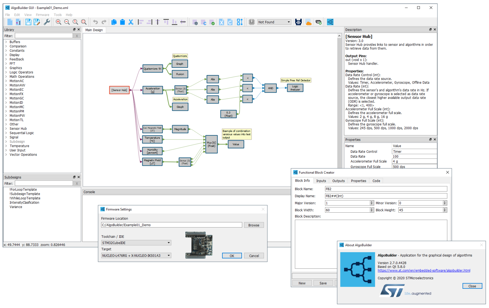

# STMems-AlgoBuilder

## Overview
[AlgoBuidler](https://www.st.com/en/development-tools/algobuilder.html) graphical design application to build and use algorithms.

This repository provides additional files and documents which are not distributed in AlgoBuilder or AlgoBuilderSuite package.

## Content
* [AlgoBuilder Communication Protocol](Documentation/AlgoBuilderProtocol.md)  
Documentation for communication protocol which is used by firmware generated by AlgoBuilder to communicate with other applications e.g. Unicleo-GUI.

## Communication and support

For communication and support, please refer to:

- [ST Community Forum](https://community.st.com/s/) forum